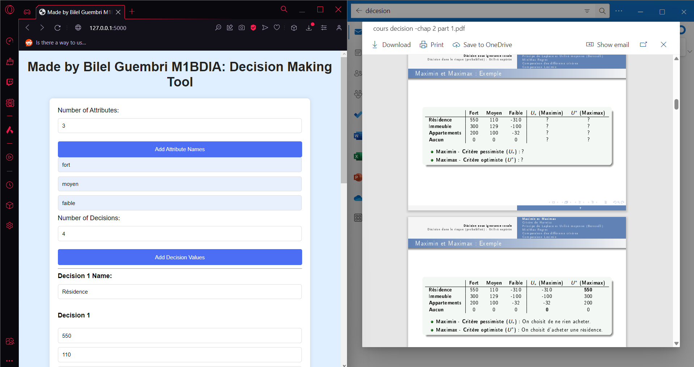
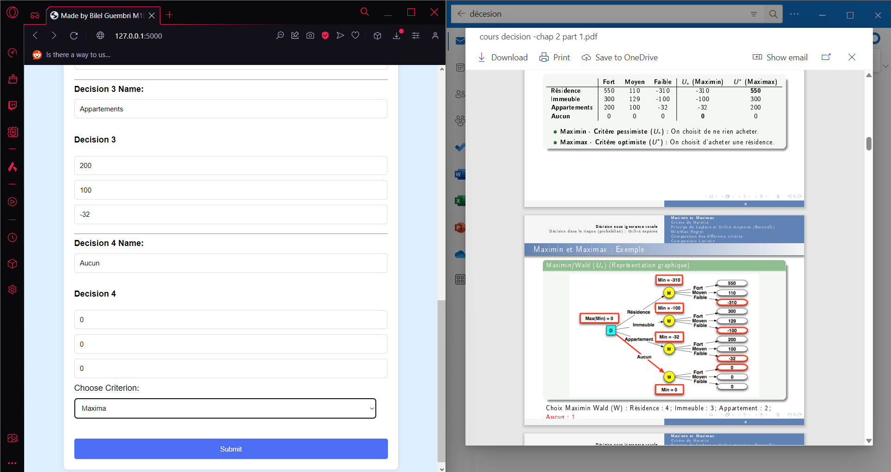

## Portefeuille personnel

Bienvenue dans mon portfolio ! Vous y trouverez une présentation de mes compétences, de mes projets et de mon parcours professionnel. Découvrez mes réalisations les plus remarquables et explorez des opportunités de collaboration enrichissantes. Ce dépôt est spécialement dédié à des projets confidentiels et personnels, offrant des descriptions détaillées et des captures d'écran à titre de référence. Merci de votre visite !

## Caractéristiques

- **Présentation Visuelle :** Un design soigné et moderne pour une expérience utilisateur optimale.
- **Projets :** Découvrez mes projets passés et en cours avec des descriptions détaillées.
- **Compétences :** Une liste exhaustive de mes compétences techniques et professionnelles.
- **Contact :** Prenez contact avec moi via les informations fournies.

## Projets achevés

## Project1 -> Analyse Approfondie de la Satisfaction des Patients dans le Contexte Médical
Dans le cadre de mon Master en Big Data et Intelligence Artificielle, j'ai mené une Analyse Approfondie de la Satisfaction des Patients dans le Contexte Médical, en utilisant des méthodes telles que l'ACP, l'AFC, l'ACM et des techniques de classification comme le K-means. Grâce à ces méthodes analytiques avancées, j'ai exploré les réponses globales à un questionnaire.

En conclusion, cette étude souligne l'importance cruciale de certains aspects, tels que le professionnalisme des soignants, la communication empathique et la compétence médicale, dans la formation de la satisfaction des patients. Ces insights fournissent des pistes précieuses pour améliorer la prestation des soins de santé et renforcer la relation patient-soignant.

Mots-clés :
Préférences d'apprentissage, ACP, AFC, ACM, Classification.

Ce rapport vise à approfondir la compréhension des déterminants de la satisfaction des patients envers les soins de santé, en explorant les relations complexes entre diverses variables. À travers des analyses approfondies, nous cherchons à dévoiler les facteurs clés influençant positivement ou négativement l'expérience des patients dans le contexte médical.
.png)
.png)
.png)
.png)

## Projet 2 -> Lauréats du 3ème Prix - Hackathon Airbnb et Jeux Olympiques 2024

Notre équipe a remporté le 3ème prix lors d'un hackathon axé sur Airbnb et les Jeux Olympiques de 2024. Le défi pour les équipes participantes consistait à proposer des améliorations de l'expérience utilisateur sur Airbnb, en intégrant l'analyse géographique, le traitement du langage naturel (NLP) et l'étude des profils des hôtes. Notre approche comprenait la compréhension des préférences des voyageurs en fonction de l'emplacement, des habitudes passées et des activités qu'ils appréciaient dans une région spécifique, en proposant des expériences adaptées aux intérêts des utilisateurs tout en prenant en compte des facteurs tels que la météo, les événements sportifs et les activités touristiques développées autour d'eux.

De plus, nous avons suggéré la mise en œuvre d'une fonction de recherche basée sur le traitement du langage naturel (NLP) pour permettre aux utilisateurs de trouver des logements en utilisant des requêtes plus naturelles et conversationnelles. Nous avons également analysé les descriptions des annonces et les avis des utilisateurs pour comprendre les caractéristiques et les commodités les plus importantes pour chaque voyageur, affinant ainsi les résultats de recherche en conséquence. Nous avons extrait les exigences demandées par les locataires et effectué une analyse sentimentale pour les catégoriser avec leurs besoins.

.png)
.png)
.png)

## Projet 3 -> Participation à un Hackathon : Système de Gestion des Ressources Humaines pour les Hôpitaux avec Intégration de l'Apprentissage Automatique

Participation à un hackathon pour développer un système de gestion des ressources humaines (HRM) pour les hôpitaux, intégrant des modèles d'apprentissage automatique pour surveiller l'état des patients et prédire en temps réel la probabilité de risques d'infections nosocomiales.

Compétences : Apprentissage Automatique · Laravel · Travail d'Équipe · Leadership d'Équipe

.png.jpg)
.jpg)
.jpg)
.jpg)
.jpg)
.jpg)

## Projet 4 -> Top 5% dans la Compétition Kaggle - Prédiction des Prix des Maisons

Participation à une compétition Kaggle pour prédire les prix des maisons à Ames, Iowa, en utilisant 79 variables explicatives. Classé 471ème, dans le top 5% des concurrents. Implémentation de techniques de prétraitement des données, y compris la gestion des valeurs manquantes et des valeurs aberrantes, l'ingénierie des caractéristiques, et utilisation de divers modèles de régression avancés. De plus, application de techniques de stacking et de blending avec des modèles tels que ElasticNet, Lasso, Ridge, SVR, GradientBoosting, XGBoost et LightGBM pour les prédictions.

.png)
.png)
.png)

## Project 5 -> Projet d'analyse et de sélection de modèles pour la prédiction de l'antigène spécifique de la prostate (lpsa)
Ce projet a pour objectif de développer des modèles prédictifs précis et robustes afin d'estimer le niveau d'antigène spécifique de la prostate (PSA) à partir de diverses variables cliniques. Le PSA est un biomarqueur essentiel pour évaluer le risque de cancer de la prostate. Les données exploitées proviennent de l'étude de Stamey et al. (1989) et comprennent des variables telles que le logarithme du volume du cancer, le logarithme du poids de la prostate, l'âge, ainsi que d'autres caractéristiques cliniques pertinentes.

Le projet débute par une phase d'exploration des données, comprenant la visualisation des distributions, la vérification des valeurs manquantes et la normalisation des variables pour garantir la qualité des données avant la modélisation. Plusieurs techniques sont ensuite appliquées, notamment des modèles linéaires classiques, des méthodes de sélection de modèles, des techniques de régularisation (Ridge, Lasso, Elastic Net), ainsi que des régressions par moindres carrés partiels (PLS) et des régressions sur composantes principales (PCR).

Chaque méthode est évaluée avec différentes configurations pour garantir l'optimalité des modèles. Des techniques de validation croisée sont utilisées pour sélectionner les meilleurs hyperparamètres et évaluer les performances prédictives de chaque modèle. L'objectif est de comparer ces approches afin d'identifier la méthode la plus efficace et applicable dans un contexte clinique pour prédire le niveau de PSA.

Compétences : Apprentissage automatique

.png)
.png)
.png)
.png)

## Project 6 -> Comparaison des Algorithmes pour la Résolution du Problème des N-Reines en Intelligence Artificielle

Cette étude compare divers algorithmes pour résoudre le problème des N-Reines, un problème classique en intelligence artificielle. Le problème des N-Reines consiste à placer N reines sur un échiquier de N × N de manière à ce qu'aucune reine ne menace une autre, selon les règles des échecs. Le problème est formalisé comme un Problème de Satisfaction de Contraintes (CSP).

Objectifs :

- Formaliser le problème des N-Reines en tant que CSP.
- Implémenter et comparer l'algorithme AC3, la recherche en profondeur avec retour en arrière, et l'algorithme de vérification en avant.
- Analyser les résultats et tirer des conclusions.

Compétences : Intelligence Artificielle (IA) · Algorithmes

.png)
.png)
.png)
.png)
.png)

## Project 7 -> Q-Learning Algorithm Implementation for Maze Solving

Ce projet, faisant partie du programme de Master en Big Data et Intelligence Artificielle, se concentre sur l'implémentation de l'algorithme Q-learning pour résoudre des problèmes de labyrinthe. L'objectif est de former un agent à trouver le chemin le plus court entre un point de départ et un point de sortie dans un labyrinthe, tout en évitant les murs. Le projet implique de créer la structure du labyrinthe, de définir les états, les actions, les récompenses et les paramètres de l'algorithme, de former l'agent en utilisant le Q-learning et de valider sa capacité à trouver des chemins optimaux dans diverses configurations de labyrinthe.

Compétences : Apprentissage par renforcement

.png)
.png)
.png)
.png)

## Projet 8 -> Outil de Prise de Décision en Situation d'Incertitude : Une Application Web en Python Flask

Ce projet, développé pendant mes études universitaires, consistait à créer une application web utilisant Python Flask pour aider à la prise de décision en situation d'incertitude. L'outil permet aux utilisateurs de saisir des critères de décision et des poids pour chaque critère. Il calcule ensuite le résultat de la décision en utilisant des méthodes telles que maximin, maximax, Laplace, Bernoulli, Hurwicz et minimax regret. Cela permet aux utilisateurs de comparer les résultats et de prendre des décisions éclairées.

Compétences : Prise de Décision

## Projet 9 -> Web Scraper et recommandation de produit

Participez à notre projet de web scraping, qui extrait des informations sur les produits de divers sites de commerce électronique en Tunisie, tels que Mytek, Tunisianet, et SBS Informatique. Les données extraites sont stockées dans une base de données MySQL, offrant des fonctionnalités telles que l'extraction de données, le stockage en base de données, la visualisation, le filtrage et la prédiction.

.png)
.png)
.png)
.png)
.png)
.png)

## Projet 10: Participation au hackathon "HACKATHON INNOV'it V2.0" les 4, 5 et 6 mars 2022 à l'ISAMM, présenté par les jeunes ingénieurs de l'ISAMM
Nous y avons développé une solution pour le recyclage des vêtements essentiellement en coton.

## Projet 11 -> Plateforme d'apprentissage en ligne

Embarquez pour un voyage d'apprentissage des langues avec notre plateforme eLearning propulsée par PHP. Similaire à Udemy, elle offre une expérience d'apprentissage dynamique et certifiée pour les passionnés de langues. Profitez d'un design réactif, de parcours d'apprentissage personnalisables, d'instructeurs certifiés et d'un environnement sécurisé et riche en fonctionnalités. Commencez votre voyage linguistique dès aujourd'hui, maîtrisez de nouvelles compétences et obtenez des certifications reconnues.

- Apprentissage personnalisé avec des programmes de formation adaptatifs.
- Évaluation complète des compétences et suivi des progrès.
- Interaction avec des modèles 3D pour une visualisation immersive des concepts linguistiques.
- Intégration d'API utilisant Django et Django REST pour une interaction transparente avec le frontend.
- Chatbot intelligent propulsé par Flask, utilisant le traitement du langage naturel (NLP).
- Fonctionnalités du chatbot incluant la clarification du sens des mots, la réponse aux questions des utilisateurs et la fourniture de définitions précises.
- Évaluation de la sécurité avec Nmap, Nikto, OWASP Zap, Burp Suite, DirBuster et GoldenEye.

**Technologies :** Django, Python, Flask, React.js, Three.js, PostgreSQL.

**Retours :**
Flight2Fluency, acclamé avec la note la plus élevée de la promotion 2023, dispose d'un chatbot avancé utilisant Flask, NLP et l'intégration de modèles 3D. Les apprenants bénéficient d'une assistance linguistique interactive, d'explications précises sur le sens des mots et de réponses conviviales aux requêtes. L'évaluation robuste de la sécurité du projet et la pile technologique, comprenant Django, Python, React.js, Three.js et PostgreSQL, ont suscité des critiques positives pour son excellence globale.

.png)
.png)

## Project 12 -> Gestionnaire Web du site et CRM

Découvrez notre plateforme complète de gestion de projets et de CRM, une solution basée sur PHP conçue pour simplifier la gestion de projets et les processus de gestion des relations clients. Cette plateforme tout-en-un comprend une gestion unifiée des projets, la gestion des ventes et des clients, la collaboration en équipe, et des tableaux de bord personnalisables. Avec une interface conviviale et une évolutivité, elle vise à améliorer la productivité et à garantir une expérience sécurisée et fiable.

**Caractéristiques principales :**
- Gestion unifiée des projets
- Gestion des ventes
- Gestion des clients
- Collaboration en équipe
- Tableaux de bord personnalisables
- Rapports et analyses
- Interface conviviale
- Évolutive et flexible
- Sécurisée et fiable

.png)
.png)

## Project 13 -> Plateforme d'apprentissage en ligne pour l'amélioration des compétences linguistiques et la préparation aux tests
Cette plateforme offre des expériences d'apprentissage personnalisées avec des programmes de formation adaptatifs et des évaluations complètes des compétences. Elle propose des outils innovants pour une visualisation immersive des concepts linguistiques et le suivi des progrès.

.png)
.png)
.png)
.png)
.png)

## Projet 14 -> Script Polyvalent de Nouvelles et de Magazine

Découvrez la polyvalence de notre script de nouvelles et de magazine alimenté par PHP, offrant un design épuré, réactif et convivial pour la création et la gestion de sites web sophistiqués. Doté de fonctionnalités telles que le support multilingue, le support RTL, l'optimisation SEO et une variété d'options de mise en page, ce script garantit une expérience fluide tant pour les administrateurs que pour les visiteurs.

**Caractéristiques Clés :**
- Design épuré et réactif
- Système multilingue
- Support RTL
- Optimisation SEO
- Options de mise en page variées
- Système de gestion des auteurs
- Système d'agrégation RSS
- Espaces publicitaires
- Support des Progressive Web Apps (PWA)
- Intégration AWS S3
- Données structurées
- Pages éditables
- Page de contact
- Liste de lecture
- Articles mis en avant, Fil d'actualités et Réactions Emoji
- Formats de publication variés
- Publications programmées et en attente
- Gestion des newsletters et des abonnés
- Chargement dynamique des images et système de tags
- Sondages de vote et intégration sociale
- Widgets et comptage des vues de pages
- Système de commentaires
- Gestion des rôles et permissions
- Système d'adhésion
- Paramètres avancés et personnalisation visuelle
- Sécurité et authentification

.png)
.png)
.png)
.png)

## Portfolio personnel
Ceci est mon portfolio personnel ! Je suis Bilel, un freelancer dévoué titulaire d'un Master en Big Data et Intelligence Artificielle de l'Université Paris Dauphine. Je me spécialise en science des données, apprentissage automatique, développement web, et bien plus encore. Mon parcours dans le monde de la technologie est guidé par une passion pour la création de solutions innovantes qui améliorent l'apprentissage et simplifient les processus.
https://bilelguembri.netlify.app

.png)
.png)
.png)
.png)

Merci de visiter la section "Mes Projets" de mon portfolio ! Si vous avez des questions ou si vous souhaitez explorer un projet plus en détail, n'hésitez pas à me contacter. Votre intérêt est grandement apprécié !
